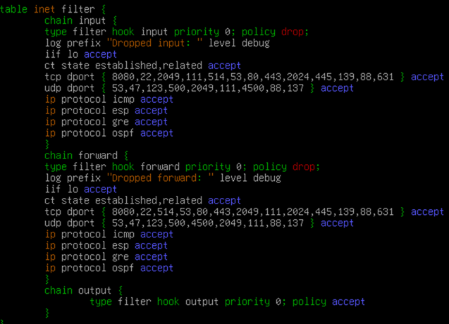
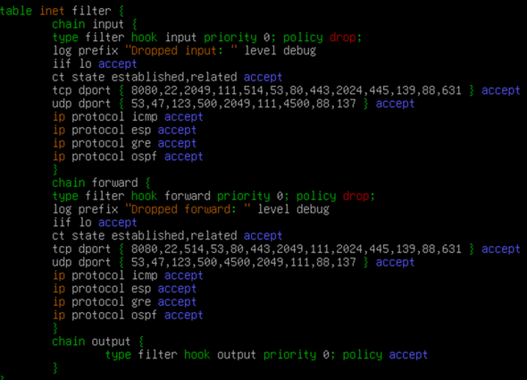

### 
<b>2. Сконфигурируйте файловое хранилище</b>

<b>(СДЕЛАТЬ SNAPSHOT, если не сделали, на HQ-SRV)</b>

- При помощи двух подключенных к серверу дополнительных дисков размером 1 Гб сконфигурируйте дисковый массив уровня 0
- Имя устройства – md0, при необходимости конфигурация массива размещается в файле /etc/mdadm.conf
- Создайте раздел, отформатируйте раздел, в качестве файловой системы используйте ext4
- Обеспечьте автоматическое монтирование в папку /raid

Подготовка дисков

<b>*HQ-SRV*</b>

Убедитесь, что дополнительные диски распознаны системой. Список подключенных дисков можно проверить командой:

  

Создайте RAID 0 массив из двух 1Гб дисков (предположим, они определены как /dev/sda, /dev/sdb:

Скачаем службу mdadm:

  

Создание RAID-массива:
где:

/dev/md0 — устройство RAID, которое появится после сборки;
-l 0 — уровень RAID;
-n 2 — количество дисков, из которых собирается массив;
/dev/sd{b,c} — сборка выполняется из дисков sdb, sdc и sdd.

> mdadm --create --verbose /dev/md0 -l 0 -n 2 /dev/sda /dev/sdb

Результат:

  

Проверяем:

  

Сохраняем конфигурацию массива в файле /etc/mdadm.conf:

>mdadm --detail --scan --verbose | tee -a /etc/mdadm.conf

Результат:

  

Создание файловой системы для массива

>mkfs.ext4 /dev/md0

Результат:

  

Чтобы данный раздел также монтировался при загрузке системы, добавляем в fstab

>nano /etc/fstab

следующую информацию:

  

  

Выполняем монтирование:

>mount -av

Результат:

  

Проверяем:

>df -h

Результат:

  

### 
<b>3. Настройте сервер сетевой файловой системы (nfs) на HQ-SRV</b>

- В качестве папки общего доступа выберите /raid/nfs, доступ для чтения и записи исключительно для сети в сторону HQ-CLI
- На HQ-CLI настройте автомонтирование в папку /mnt/nfs
 - Основные параметры сервера отметьте в отчёте

<b>*HQ-SRV*</b>

Устанавливаем пакеты для NFS сервера:

>apt-get install -y nfs-server cifs-utils

Создаём директорию для общего доступа /raid/nfs, куда ранее был смонтирован RAID - массив:

>mkdir /raid0/nfs

Назначаем права на созданную директорию (полный доступ):

>chmod 777 /raid0/nfs

Редактируем файл /etc/exports:

>nano /etc/exports

Добавляем туда следующую информацию, где:
/raid/nfs - общий ресурс
192.168.200.0/24 - клиентская сеть, которой разрешено монтирования общего ресурса
rw — разрешены чтение и запись
no_root_squash — отключение ограничения прав root

  

Экспортируем файловую систему, указанную выше в /etc/exports:

> exportfs -arv

Результат:
exportfs с флагом -a, означающим экспортировать или отменить экспорт всех каталогов
-r означает повторный экспорт всех каталогов, синхронизируя /var/lib/nfs/etab с /etc/exports и файлами в /etc/exports.d
а флаг -v включает подробный вывод:

  

Запускаем и добавляем в автозагрузку NFS - сервер:
>update-initramfs -u

>systemctl enable --now nfs-server

<b>*HQ-CLI*</b>

Выполняем установку пакетов для NFS - клиента:

>apt-get update && apt-get install -y nfs-utils nfs-clients

Создадим директорию для монтирования общего ресурса:

>mkdir /mnt/nfs 

Задаём права на созданную директорию:

>chmod 777 /mnt/nfs 

Настраиваем автомонтирование общего ресурса через fstab:

>nano /etc/fstab

Добавляем следующую информацию:
где: 192.168.100.2 - адрес файлового сервера (HQ-SRV)

  

Выполняем монтирование общего ресурса:

>mount -av

Результат:

  

Проверяем:

>df -h

Результат:

  

### 
<b>4. Настройте службу сетевого времени на базе сервиса chrony</b>

- В качестве сервера выступает ISP 
- На ISP настройте сервер chrony, выберите стратум 5
- В качестве клиентов настройте HQ-SRV, HQ-CLI, BR-RTR, BR-SRV

1. Настройка NTP сервера:

<b>*ISP*</b>

Установим пакет chrony на каждой машине:

***apt update && apt install -y chrony*** 

Приводим конфигурационный файл "chrony.conf" к следующему виду:

***nano /etc/chrony/chrony.conf***

  

> где:
> - server 127.0.0.1 iburst prefer - указываем сервером синхронизации самого себя, опция «iburst» принудительно отправляет сразу несколько пакетов для точности синхронизации,  
> - hwtimestamp * - опция, чтобы сетевой интерфейс считал собственный источник времени верным и синхронизировал клиентов с ним;  
> - local stratum 5 - устанавливаем для себя значение по stratum = 5;  
> - allow - кому разрешается подключаться к серверу и запрашивать время: чтобы не перечеслять все используемые в задании IPv4 и IPv6 сети, используется 0/0 и ::/0;  

Запускаем и добавляем в автозагрузку службу chronyd, и не забываем рестартать сервис:

***systemctl enable --now chrony***  
***systemctl restart chrony***

  

Проверяем:

  

2. Настройка NTP клиентов:

<b>*HQ-SRV, BR-SRV, BR-RTR, HQ-CLI*</b>

Установим пакет chrony:

***apt install -y chrony***

Приводим конфигурационный файл "chrony.conf" к следующему виду:

***nano /etc/chrony/chrony.conf***
> На HQ-CLI /etc/chrony.conf

  

> где: 172.16.1.1 - IPv4 адрес ISP;

Запускаем и добавляем в автозагрузку службу chronyd:

systemctl enable --now chrony 
> на cli chronyd

systemctl restart chrony
> на cli chronyd

Проверяем с клиента HQ-SRV:

  

Проверяем с сервера ISP :
> Не пугайтесь что там только два клиента, так и должно быть

  

BR-RTR | BR-SRV | CLI: Настройка аналогична HQ-SRV - за исключением указания соответствующих адресов

> **РЕКОМЕНДАЦИЯ:**
> НА HQ-SRV скачиваем: apt install -y git  
> НА HQ-RTR скачиваем: apt install nginx -y

### 
<b>5. Сконфигурируйте ansible на сервере BR-SRV</b>

<b>(СДЕЛАЙ SNAPSHOT НА BR-SRV)</b>

- Сформируйте файл инвентаря, в инвентарь должны входить HQ-SRV, HQ-CLI, HQ-RTR и BR-RTR 
- Рабочий каталог ansible должен располагаться в /etc/ansible 
- Все указанные машины должны без предупреждений и ошибок отвечать pong на команду ping в ansible посланную с BR-SRV

<b>*BR-SRV*</b>

1. Установите Ansible (если он еще не установлен):

***apt update && apt install ansible -y***

2. Создание рабочего каталога Ansible

Ansible обычно уже использует /etc/ansible как рабочий каталог, но если его нет, создайте его вручную:

  

3. Создание файла инвентаря

  

  

4. Настройка SSH-доступа к машинам

Для того чтобы Ansible мог управлять машинами без необходимости ввода пароля, настройте SSH-доступ:

  

______________________________________________________________________________________

<b>(ДОПОЛНЕНИЕ)</b>

<b>*HQ-CLI*</b>

> Ранее в рекомендациях должно было быть скачено

Для hq-cli нужно установить ssh службу: ***apt-get install -y openssh-server***

Перезагружаем ssh на hq-cli: ***systemctl restart sshd***

> Ранне в рекомнедациях должно было быть перезагружено

Для того чтобы зайти в конфиг ssh на альт линукс(cli) нужно ввести команду:
***nano /etc/openssh/sshd_config***

______________________________________________________________________________________

Скопируйте SSH-ключ на всех машинах в инвентаре : Выполните эту команду для каждой машины, чтобы разрешить безпарольный доступ:

  

  

> Дмитрий Игоревич забыл прописать порт 2026 в /etc/ssh/sshd_config на HQ-SRV и BR-SRV, так что прописываем за него и перезагружаем службу systemctl restart sshd

  

  

5. Проверка подключения в Ansible

Выполните команду "ansible all -m ping" для проверки соединения со всеми хостами из инвентаря файла:

  

### 
<b>6. Развертывание приложений в Docker на сервере BR-SRV.</b>

-• Средствами docker должен создаваться стек контейнеров с веб
приложением и базой данных

• Используйте образы site_latestи mariadb_latestрасполагающиеся в
директории docker в образе Additional.iso

• Основной контейнер testapp должен называться tespapp

• Контейнер с базой данных должен называться db

• Импортируйте образы в docker, укажите в yaml файле параметры
подключения к СУБД, имя БД - testdb, пользователь testс паролем
P@ssw0rd, порт приложения 8080, при необходимости другие
параметры

• Приложение должно быть доступно для внешних подключений через
порт 8080

<b>*BR-SRV*</b>

1. Скачиваем докер:

***apt install -y docker.io docker-compose***

2. Включаем и добавляем в автозагрузку службу docker:

***systemctl enable --now docker.service***

3. Выполнить монтирование Additional.iso в директорию /mnt:

  

- Выполнить импорт образа mariadb_latest и site_latest:

>docker load < /mnt/docker/site_latest.tar

  

> docker load < /mnt/docker/mariadb_latest.tar

  

- Проверить:

  

заходим на hq-cli, подключаемся через ssh к br-srv. (ssh sshuser@192.168.0.2)

затем заходим в compose.yaml: nano compose.yaml

Вписываем туда код с ссылки:

>compose.yaml https://raw.githubusercontent.com/shiraorie/demo2026-1/main/files/compose.yaml

Либо если получится копировать, то через фаерфокс зайдём на по этой ссылки и скопируем весь текст и вставим его в compose.yaml (обязательно через ssh, иначе работать не будет)

  

- Запустить набор контейнеров с веб приложением и базой данных:

  

- Проверяем набор контейнеров с веб приложением и базой данных:

  

- Проверяем доступ до веб приложения с браузера:

  

### 
<b>7. Разверните веб приложениена сервере HQ-SRV:</b>

- Используйте веб-сервер apache
- В качестве системы управления базами данных используйте mariadb
- Файлы веб приложения и дамп базы данных находятся в директории web
образа Additional.iso
- Выполните импорт схемы и данных из файла dump.sql в базу данных
webdb
66
- Создайте пользователя webс паролем P@ssw0rd и предоставьте ему
права доступа к этой базе данных
- Файлы index.php и директорию images скопируйте в каталог веб сервера
apache
- В файле index.php укажите правильные учётные данные для
подключения к БД
- Запустите веб сервер и убедитесь в работоспособности приложения
- Основные параметры отметьте в отчёте

<b>*HQ-SRV*</b>

> Ранее в "рекомендациях" должно было быть скачено

Устанавливаем веб-сервер Apache2 и необходимые пакеты:

>apt install -y apache* -y

Устанавливаем PHP и необходимые модули:

>apt install -y php php8.2 php-curl php-zip php-xml libapache2-mod-php php-mysql php-mbstring php-gd php-intl php-soap -y

Установка СУБД MySQL:

> apt install -y mariadb-* -y
> Ранее в "рекомендациях" должно было быть скачено

Включаем и добавляем в автозагрузку MySQL:

***systemctl enable --now mariadb***  
***systemctl enable --now apache2***

Выполнить монтирование Additional.iso в директорию /mnt:

> mount /dev/sr0 /mnt/
 

  

Произвести копирование файлов веб приложения index.php и logo.png в директорию /var/www/html:

>cp /mnt/web/index.php /var/www/html

>cp /mnt/web/logo.png /var/www/html

В файле /var/www/html/index.php указать правильные учётные данные для подключения к БД:

> nano /var/www/html/index.php

  

после монтирования(mount) переходим в mnt: cd /mnt/web

после перехода нужно копировать dump.sql: cp dump.sql /root

затем переходим в /root (можно просто написать cd либо же cd /root)

(ICONV НЕ ДЕЛАЕМ, ИНАЧЕ ВСЁ СЛОМАЕТСЯ)

Перейти в интерфейс управления MariaDB:

>mariadb –u root

Создать базу данных с именем webdb:

>CREATE DATABASE webdb;

Создать пользователя webc с паролем P@ssw0rd:

>CREATE USER ‘webc’@’localhost’ IDENTIFIED BY ‘P@ssw0rd’;

Назначить пользователю webc полные права на базу данных webdb, после чего выйти из интерфейса управления MariaDB:

>GRANT ALL PRIVILEGES ON webdb.* TO ‘webc’@’localhost’ WITH GRANT OPTION;
EXIT;

Выполнить импорт схемы и данных из файла dump.sql в базу данных webdb:

>mariadb –u webc –p –D webdb < ~/dump.sql

Проверить:

  

Удалить стандартную станицу

> rm /var/www/html/index.html

Включить и добавить в автозагрузку службу apache2:

>systemctl enable --now apache2
>systemctl restart apache2

Проверяем доступ до веб приложения с браузера:

  

### 
<b>8. На маршрутизаторах сконфигурируйте статическую трансляцию портов</b>

- Пробросьте порт 8080 в порт приложения     testapp BR-SRV на маршрутизаторе BR-RTR, для обеспечения работы приложения     testapp извне
- Пробросьте порт 8080 в порт веб приложения на HQ-SRV на маршрутизаторе HQ-RTR, для обеспечения работы веб приложения извне
- Пробросьте порт 2026 на маршрутизаторе HQ-RTR в порт 2026 сервера HQ-SRV, для подключения к серверу по протоколу ssh из внешних сетей
- Пробросьте порт 2026 на маршрутизаторе BR-RTR в порт 2026 сервера BR-SRV, для подключения к серверу по протоколу ssh из внешних сетей.

<b>*BR-RTR*</b>

  

<b>*HQ-RTR*</b>

  

### 
<b>9. Настройте веб-сервер  как обратный прокси-сервер на ISP</b>

- При обращении по доменному имени web.au-team.irpo у клиента должно открываться веб приложение на HQ-SRV
- При обращении по доменному имени docker.au-team.irpo клиента должно открываться веб приложение     testapp.

<b>*ISP*</b>

Установить пакет nginx:

>apt-get install -y nginx

Запустите и активируйте Nginx:

***systemctl start nginx***  
***systemctl enable nginx***

Настройка Nginx как обратного прокси

Создадим конфигурационный файл для сайта в Nginx, в котором настроим виртуальные хосты. Добавьте конфигурацию для проксирования запросов в файл reverse-proxy.conf:

https://raw.githubusercontent.com/shiraorie/demo2026-1/main/files/reverse-proxy.conf

(Если лень, то создайте пользователя ssh (точно также как и для сервера) и зайдите через hq-cli по ssh на ISP(ip смотрим через ip -c a ens192) затем зайдите на ссылку и копируйте. далее переходим в nano /etc/nginx/sites-avaiable/reverse-proxy.conf и вставляем туда

  

  

> Сохраните файл и закройте редактор.

Добавить символическую ссылку на данный файл:

>ln -s /etc/nginx/sites-available/default /etc/nginx/sites-enabled/

Проверить наличие ошибок в конфигурационных файлах:

  

Запустить и активировать службу nginx:
>systemctl enable --now nginx

<b>*HQ-CLI*</b>

Поскольку в домене SambaDC нет DNS записей ссылающихся на необходимые имена, а на HQ-CLI в качестве DNS-сервера задан адрес именно контроллера домена, поэтому необходимо добавить записи в файл /etc/hosts на виртуальной машине HQ-CLI:

  

Проверяем возможность доступа до веб ресурсов с браузера на клиенте:

>http://web.au-team.irpo

>http://docker.au-team.irpo

### 
<b>10. На маршрутизаторе ISP настройте web-based аутентификацию</b>

- При обращении к сайту web.au-team.irpo клиенту должно быть предложено ввести аутентификационные данные
- В качестве логина для аутентификации выберите WEB с паролем P@ssw0rd
- Выберите файл /etc/nginx/.htpasswd в качестве хранилища учётных записей
- При успешной аутентификации клиент должен перейти на веб сайт.

<b>*ISP*</b>

Установить пакет apache2:

>apt install -y apache2

Средствами утилиты htpasswd создать пользователя WEB и добавить информацию о нём в файл /etc/nginx/.htpasswd, задав пароль P@ssw0rd:

htpasswd –c /etc/nginx/.htpasswd WEB

  

Добавить web-based аутентификацию для доступа к сайту web.au-team.irpo в конфигурационный файл /etc/nginx/sites-available.d/default.conf:

>nano /etc/nginx/sites-available/default

  

Проверить наличие ошибок в конфигурационных файлах:

  

Перезапустить службу nginx:

>systemctl restart nginx

<b>*HQ-CLI*</b>

Проверяем возможность доступа до веб ресурса с браузера на клиенте:

Имя пользователя: WEB
Пароль: P@ssw0rd

  

### 
<b>11. Удобным способом установите приложение Яндекс Браузере для организаций</b>

<b>*HQ-CLI*</b>

  

  

  

> **ПРИМЕЧАНИЕ:**
> Установку браузера отметьте в отчёте

> **РЕКОМЕНДАЦИЯ:**
> Скачиваем на HQ-SRV: apt install cups cups-pdf -y  
> Скачиваем на HQ-CLI: apt-get install cups cups-pdf -y

## 
<b>МОДУЛЬ 3</b>

<b></b>

### 
<b>3.	Перенастройте ip-туннель с базового до уровня туннеля, обеспечивающего шифрование трафика</b>

<b>*HQ-RTR*</b>

1. Для начала необходимо установить пакет на наш роутер *HQ-RTR*:

***apt update***  
***apt install strongswan***

  

2. Конфигурация IPsec:

На обоих роутерах отредактируйте файл /etc/ipsec.conf, добавив следующее:

  

Далее нужно настроить файл ipsec.secrets. Вносим туда строку:

***172.16.4.2 172.16.5.2 : PSK “123qweR%”***

  

Ещё один конфиг charon.conf, открываем его b редактируем в нём следующую строку, приводя к виду:

***install_routes = no***

  

И осталось только перезагрузить службу ipsec:

***ipsec restart***

  

<b>*BR-RTR*</b>

1. Для начала необходимо установить пакет на наш роутер *BR-RTR*:

***apt update***  
***apt install strongswan***

  

2. Конфигурация IPsec:

На обоих роутерах отредактируйте файл /etc/ipsec.conf, добавив следующее:

  

Далее нужно настроить файл ipsec.secrets. Вносим туда строку:

***172.16.5.2 172.16.4.2 : PSK “123qweR%”***

  

Ещё один конфиг charon.conf, открываем его и редактируем в нём следующую строку, приводя к виду:

***install_routes = no***

  

И осталось только перезагрузить службу ipsec:

***ipsec restart***

  

3. Также можно проверить передаются ли зашифрованные пакеты по сети, для этого нам пригодится утилита tcpdump *на BR-RTR*:

***apt install tcpdump***

И теперь мы можем проверить это, пропишем на роутере *BR-RTR* команду:
  
***tcpdump -i ens192 -n -p esp***

А на роутере *HQ-RTR* отправим эхо-запрос на порту в сторону branch(br-srv):

***ping 192.168.200.2***

Как можно заметить, на правом роутере мы видим зашифрованные пакеты с меткой ESP:

  

<b>Слева HQ-RTR - Cправа BR-RTR</b>

> Если IPsec настроен правильно, вы должны видеть защищённый трафик между вашими серверами.

### 
<b>4.	Настройте межсетевой экран на маршрутизаторах HQ-RTR и BR-RTR на сеть в сторону ISP</b>

Для выполнения этого задания нам нужно обеспечить работу только нужных протоколов, а именно: HTTP, HTTPS, DNS, NTP, ICMP. А также запретить остальные подключения из сети Интернет во внутреннюю сеть.

<b>*HQ-RTR*</b>

Заходим в nftables и вписываем все порты

  

- Не забываем применять:

  

<b>*BR-RTR *</b>

Тоже заходим на nftbales, и делаем такую же настройку

  

- Не забываем применять:

  

- И проверим, не отвалился ли туннель ipsec после настройки правил на HQ-RTR:

***ipsec status***

  

> Видим, что соединение установлено и всё хорошо!

Проверим также наличие связи между конечными устройствами, отправим эхо-запрос с *HQ-CLI на BR-SRV*:

***ping 192.168.200.2***

  

> Связь есть, всё отлично! Задание выполнено!

### 
<b>5.	Настройте принт-сервер cups на сервере HQ-SRV.</b>

- Опубликуйте виртуальный pdf-принтер
- На клиенте HQ-CLI подключите виртуальный принтер как принтер по
умолчанию.

1. Для начала необходимо установить пакеты cups и cups-pdf на HQ-SRV:
> на hq-srv и на hq-cli устанавливаем cups: apt install cups cups-pdf
> далее запускаем cups: systemctl enable cups
> производим настройку cups: cupsctl --share-printers --remote-any
>	systemctl restart cups
>	затем на hq-cli докачиваем файлы: apt install cups system-config-printer -y
>	затем в поиске пишем print settings и заходим. Жмём add выбираем enter uri и пишем http://ip-сервера:631/printers/PDF

  

Теперь необходимо включить службу cups, чтобы она запускалась вместе с системой:

***systemctl enable –now cups***

Настроим CUPS

  

Перезапускаем службу cups для применения изменений:

systemctl restart cups

2. Переходим к подключению клиента HQ-CLI

Скачиваем cups:

***apt-get install cups system-config-printer -y***

Доббавляем принтер в Хосты клиента

  

Открываем пуск и ищем Print settings

  

Жмем add
Далее ENTER URL, вписываем http://192.168.100.2:631/printers/PDF

  

Жмем forward, опять forward, далее листаем вверх и выбираем  CUPS-PDF

  

Жмем forward, Aply

Появится print test page

  

Если видите что принтер в простое то поздравляю 

  

### 
<b>6.	 Реализуйте логирование при помощи rsyslog на устройствах HQ-RTR, BR-RTR, BR-SRV</b>

1. Сперва необходимо настроить наш сервер для сбора логов.

Установим пакет rsyslog на HQ-SRV:

apt install rsyslog

Далее, отредактируем файл конфигурации, расположенный по пути
/etc/rsyslog.conf:

  

> Для передачи логов будем использовать протокол TCP, поэтому раскомментируем (уберем #) модуль imtcp, чтобы rsyslog мог получать логи с удаленных узлов.

  

> Также необходимо в конец конфига добавить шаблон для сбора логов, чтобы rsyslog сохранял логи по пути, который указан в задании.

Включаем службу rsyslog, чтобы она запускалась вместе с системой и перезапускаем ее для применения изменений:

***systemctl enable rsyslog***  
***systemctl restart rsyslog***

  

> Сервер для приема логов настроен

2. Переходим к настройке клиентов. Начнем с роутеров.

Установим пакет rsyslog на HQ-RTR:

  

  

Далее, отредактируем файл конфигурации, расположенный по пути
/etc/rsyslog.conf:

  

> В блоке MODULES необходимо раскомментировать модули, которые обеспечивают поддержку логирования. (Все кроме модуля imuxsock, потому что вместо него будет использован модуль imjournal). Модуль imjournal придется дописать вручную.

Теперь опускаемся в самый низ конфига, там расположены правила.

Добавляем в самый конец строку, которая отвечает за отправку логов уровня предупреждения (warning) и выше:

****.warning @@192.168.100.2:514***

  

Теперь перезапускаем службу rsyslog, чтобы применить изменения.

***systemctl restart rsyslog***

*НА BR-RTR НУЖНО ПОВТОРИТЬ АНАЛАГИЧНО.*

3. Продолжаем настройку клиентов на BR-SRV

Установим на BR-SRV пакет rsyslog:

***apt install rsyslog***

  

Далее, отредактируем файл конфигурации, расположенный по пути /etc/rsyslog.conf:

  

> Здесь также необходимо раскомментировать модули imjournal, imklog, immark

  

> И добавить строку в конец конфига для того, чтобы логи отправлялись на сервер.

Включаем службу rsyslog, чтобы она запускалась вместе с системой и перезапускаем ее для применения изменений:

***systemctl enable rsyslog***  
***systemctl restart rsyslog***

  

4. За время пока выполнялась настройка клиентов уже должны появиться логи, проверим каталог /opt на HQ-SRV:

  

> Как можно заметить, были автоматически созданы каталоги с именами клиентов. В каждом из них есть файл rsyslog.txt

Проверим, что логируются только сообщения уровня warning и выше.

Добавим несколько записей различного уровня в лог на любом из клиентов, например на BR-SRV, командами:

***logger -p user.info “Test info”***

***logger -p user.warning “Test warning”***
> сообщения уровня warning:

***logger -p user.error “Test error”***
> сообщения уровня error:

  

Теперь проверим на HQ-SRV содержимое файла /opt/br-srv/rsyslog.txt:

  

> Как можно заметить, здесь появились только сообщения уровня warning и error.

5. Перейдем к настройке ротации логов. На HQ-SRV создадим файл /etc/logrotate.d/rsyslog
Запишем в него следующее содержимое:

  

> Настройка ротации на этом закончена, каждую неделю будут проверяться логи и если какие-то из них больше 10МБ, они будут сжаты в архив.

### 
<b>7. На сервере HQ-SRV реализуйте мониторинг устройств с помощью открытого программного обеспечения. Обеспечьте доступность по URL - https://mon.au-team.irpo</b>

-	Мониторить нужно устройства HQ-RTR, HQ-SRV, BR-RTR и BR-SRV
-	В мониторинге должны визуально отображаться нагрузка на ЦП, объем занятой ОП и основного накопителя
-	Логин и пароль для службы мониторинга admin P@ssw0rd
-	Выбор программного обеспечения, основание выбора и основные параметры с указанием порта, на котором работает мониторинг, отметьте в отчёте

1. Сервер забикс:

***wget https://repo.zabbix.com/zabbix/7.4/release/debian/pool/main/z/zabbix-release/zabbix-release_7.4-0.2+debian12_all.deb***

***sudo dpkg -i zabbix-release_7.4-0.2+debian12_all.deb***

  

***sudo apt update***

***sudo apt install zabbix-server-mysql zabbix-frontend-php zabbix-agent php php-mysql php-bcmath php-mbstring  zabbix-sql-scripts zabbix-apache-conf mariadb-server***

  

***zcat /usr/share/zabbix/sql-scripts/mysql/server.sql.gz | sudo mysql -u zabbix -p zabbix***

  

***sudo nano /etc/zabbix/zabbix_server.conf***

- Укажите:

***DBName=zabbix***  
***DBUser=zabbix***  
***DBPassword=P@ssw0rd***

  

- Запустите службу:

***sudo systemctl enable --now zabbix-server***

  

2. Настройка веб-интерфейса.

- Создайте символическую ссылку для доступа по нужному URL:

***ln -s /usr/share/zabbix /var/www/html/mon***

- Настройте PHP:

***sudo nano /etc/php/8.2/apache2/php.ini***

- Измените:
> чтобы быстро перемещаться по файлу ищем по строкам - ("CTRL" + "-")

***max_execution_time = 300***  /строка 409  
***max_input_time = 300***  /строка 419  
***post_max_size = 16M***  /строка 703  

  

  

- Перезапустите Apache:

  

  

  

  

***sudo systemctl restart apache2***

3. Настроить DNS на HQ-SRV:

  

- Теперь интерфейс будет доступен по адресу:

***http://mon.au-team.irpo/zabbix***

  

4. Настройка пользовательских учетных данных.

После установки войдите через браузер и авторизуйтесь с логином "Admin" и паролем "zabbix" по умолчанию. Эти данные можно изменить в интерфейсе Zabbix после входа — раздел "Administration → Users"

- ПАРОЛЬ - ЛОГИН ОТ ЗАБИКСА, Admin - zabbix. МЕНЯЕМ ПАРОЛЬ НА P@ssw0rd

  

- Забикс агент
 
***wget https://repo.zabbix.com/zabbix/7.4/release/debian/pool/main/z/zabbix-release/zabbix-release_7.4-0.2+debian12_all.deb***

***sudo dpkg -i zabbix-release_7.4-0.2+debian12_all.deb***

***sudo apt update***

***apt install zabbix-agent***

- nano /etc/zabbix/zabbix_agentd.conf - там ищешь server serverActive пишешь ип сервера hqsrv типо, потом в hsotname ниже чуть чем serverActive пишешь хостнейм.

  

***systemctl restart zabbix-agent.service***

- Идешь в cli в веб версии по скрину что выше добовляешь сревер пишешь ип туда сюда и обезатЛЬНО !!!! прям срочно нужно в хост груп указать Linux server Linux By zubbix agent

  

  

- Статистика дашборды

  

- Редачим:

  

Адд виджит пикаем график:

  

  

- Слева в инпуте выбираем сервера а с право выбираем параметры

  

  

  

  

  

> Повезло если все робит

### 
<b>8.	Реализуйте механизм инвентаризации машин HQ-SRV и HQ-CLI через Ansible на BR-SRV</b>

1. Для начала необходимо создать каталог, в котором будут размещены отчеты о рабочих местах:

***mkdir /etc/ansible/PC_INFO***

  

2. Далее, создадим плейбук /etc/ansible/inventory.yml:

- Скачиваем его с github в необходимую директори:
> !dos2unix и curl на BR-SRV уже скачаны!

***curl -o /etc/ansible/inventory.yml https://raw.githubusercontent.com/shiraorie/dewmo2026-1/main/files/inventory.yml***

***dos2unix /etc/ansible/inventory.yml***

- Потом проверяем его содержимое:

  

  

3. Проверим работу, командой:

***ansible-playbook /etc/ansible/inventory.yml***

  

> - Ansible помечает результат как changed, так как фактическое состояние системы меняется. При первом запуске плейбука это ожидаемое поведение.
> - Если запустить плейбук ещё раз, то Ansible покажет для тех же задач статус ok, потому что требуемое состояние уже достигнуто и ничего менять не нужно.

4. Проверим наличие и содержимое, созданных отчетов:

***ls -la /etc/ansible/PC_INFO***  
***cat /etc/ansible/PC_INFO/hq-cli.yml***  
***cat /etc/ansible/PC_INFO/hq-srv.yml***

  

> Как можно заметить, отчеты созданы и содержат необходимую информацию. Задание выполнено.

### 
<b>9.	Реализуйте механизм резервного копирования конфигурации для машин HQ-RTR и BR-RTR, через Ansible на BR-SRV</b>

1. Создадим также каталог, в котором будут размещены резервные копии конфигураций маршрутизаторов:

***mkdir /etc/ansible/NETWORK_INFO***

  

2. И создаём сам плейбук /etc/ansible/backup.yml:
> *ОБЯЗАТЕЛЬНО УСТАНОВИТЕ sudo НА HQ-RTR и BR-RTR*

- Скачаем файл с github в нужную директорию:
> !dos2unix и curl на BR-SRV уже скачаны!

***curl -o /etc/ansible/backup.yml https://raw.githubusercontent.com/shiraorie/demo2026-1/main/files/backup.yml***

***dos2unix /etc/ansible/backup.yml***

- Проверяем его содержимое:

  

со следующим содержимым:

*ОБЯЗАТЕЛЬНО УСТАНОВИТЕ sudo НА HQ-RTR и BR-RTR*

  

3. Абсолютно также, как и в предыдущем задании, проверяем его работу, командой:

***ansible-playbook /etc/ansible/backup.yml***

  

> - Как и в прошлом задании, Ansible помечает результат как changed, так как фактическое состояние системы меняется. При первом запуске плейбука так и должно быть.
> - И если запустить его ещё раз, то Ansible покажет для тех же задач статус ok, потому что требуемое состояние уже достигнуто и ничего менять не нужно.

4. Проверим наличие созданных отчетов:

***ls -la /etc/ansible/NETWORK_INFO***  
***ls -la /etc/ansible/NETWORK_INFO/HQ-RTR***  
***ls -la /etc/ansible/NETWORK_INFO/BR-RTR***  

  

А также их содержимое, если хотите убедиться, что действительно скопировалось, для примера покажем файл interfaces с маршрутизатора HQ-RTR, остальные можете сами:

***cat /etc/ansible/NETWORK_INFO/HQ-RTR/interfaces***

  

> По итогу все резервные копии конфигураций созданы и содержат необходимую информацию. Задание выполнено.
